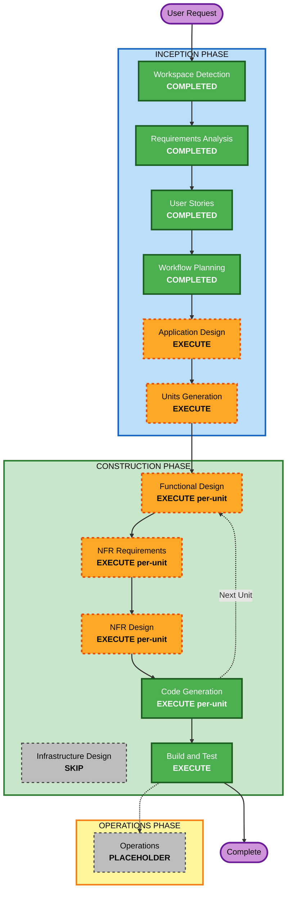

# Execution Plan — LifeOS

## Detailed Analysis Summary

### Change Impact Assessment
- **User-facing changes**: Yes — entire app is new, all 6 modules are user-facing
- **Structural changes**: Yes — greenfield Flutter project, full architecture to define
- **Data model changes**: Yes — ~25 Drift tables across 6 modules + transversal layers
- **API changes**: No — no server-side APIs (local-first app). External API integrations (AI, Open Food Facts) are post-MVP
- **NFR impact**: Yes — Security (biometrics, secure storage), Accessibility (WCAG 2.1 AA), Performance, Testing (PBT)

### Risk Assessment
- **Risk Level**: Medium
- **Rollback Complexity**: Easy (greenfield, no existing users)
- **Testing Complexity**: Complex (6 modules, cross-module interactions, 2 platforms, 92 user stories, BDD scenarios)

---

## Workflow Visualization



### Text Alternative
```
Phase 1: INCEPTION
  - Workspace Detection (COMPLETED)
  - Requirements Analysis (COMPLETED)
  - User Stories (COMPLETED)
  - Workflow Planning (COMPLETED)
  - Application Design (EXECUTE)
  - Units Generation (EXECUTE)

Phase 2: CONSTRUCTION (per-unit loop)
  - Functional Design (EXECUTE per-unit)
  - NFR Requirements (EXECUTE per-unit)
  - NFR Design (EXECUTE per-unit)
  - Infrastructure Design (SKIP)
  - Code Generation (EXECUTE per-unit)
  - Build and Test (EXECUTE)

Phase 3: OPERATIONS
  - Operations (PLACEHOLDER)
```

---

## Phases to Execute

### INCEPTION PHASE
- [x] Workspace Detection (COMPLETED)
- [x] Requirements Analysis (COMPLETED)
- [x] User Stories (COMPLETED)
- [x] Workflow Planning (COMPLETED)
- [ ] Application Design - **EXECUTE**
  - **Rationale**: Greenfield project with 6 modules + 5 transversal layers. Need to define component architecture, service layer, Riverpod provider dependency graph, Drift database schema relationships, and cross-module communication patterns. The app has ~25 data models with complex relationships (Transaction->Category, Workout->Sets->Exercise, Goal->SubGoals->Modules).
- [ ] Units Generation - **EXECUTE**
  - **Rationale**: Project is too large for a single unit. Needs decomposition into logical units that can be designed and built incrementally. Likely units: Core/Shared infrastructure, Finance module, Gym module, Nutrition module, Habits module, Dashboard, Phase 2 modules.

### CONSTRUCTION PHASE (per-unit)
- [ ] Functional Design - **EXECUTE**
  - **Rationale**: Each unit has new Drift table schemas, business logic (streak calculation, sleep score, 1RM formula, budget alerts, goal progress weighting), and data relationships that need detailed design before code generation.
- [ ] NFR Requirements - **EXECUTE**
  - **Rationale**: Security extension enabled (SECURITY-01 to SECURITY-15) — need to assess applicability for local-first app with biometrics, secure storage, and external API calls. PBT extension enabled (PBT-01 to PBT-10) — need PBT framework selection for Dart. WCAG 2.1 AA accessibility compliance required.
- [ ] NFR Design - **EXECUTE**
  - **Rationale**: NFR Requirements will produce patterns that need to be incorporated into the design: biometric authentication flow, secure API key storage, error handling patterns, accessibility widget patterns, PBT test architecture.
- [ ] Infrastructure Design - **SKIP**
  - **Rationale**: 100% local-first app with no server infrastructure, no cloud services, no deployment pipelines for backend. Flutter app is built and published to App Store/Play Store — standard mobile CI/CD, no custom infrastructure design needed.
- [ ] Code Generation - **EXECUTE** (ALWAYS, per-unit)
  - **Rationale**: Core deliverable — implement all designed components for each unit.
- [ ] Build and Test - **EXECUTE** (ALWAYS)
  - **Rationale**: Build instructions, unit tests, widget tests, integration tests, PBT tests for all units.

### OPERATIONS PHASE
- [ ] Operations - **PLACEHOLDER**
  - **Rationale**: Future deployment and monitoring workflows. App Store / Play Store submission handled in Build and Test instructions.

---

## Execution Summary

| Stage | Status | Rationale |
|---|---|---|
| Workspace Detection | COMPLETED | Greenfield detected |
| Requirements Analysis | COMPLETED | 40 FRs, 9 NFRs documented |
| User Stories | COMPLETED | 92 stories, 3 personas, 10 epics |
| Workflow Planning | COMPLETED | This document |
| Application Design | EXECUTE | Complex multi-module architecture needs definition |
| Units Generation | EXECUTE | Project too large for single unit |
| Functional Design | EXECUTE (per-unit) | New data models + business logic per module |
| NFR Requirements | EXECUTE (per-unit) | Security + PBT extensions + WCAG 2.1 AA |
| NFR Design | EXECUTE (per-unit) | Incorporate security + accessibility + testing patterns |
| Infrastructure Design | SKIP | No server infrastructure — local-first app |
| Code Generation | EXECUTE (per-unit) | Core deliverable |
| Build and Test | EXECUTE | Comprehensive testing required |

**Total stages to execute**: 10 (4 completed + 6 remaining)
**Stages skipped**: 2 (Infrastructure Design, Operations)

## Success Criteria
- **Primary Goal**: Functional cross-platform Flutter app (iOS + Android) with 4 MVP modules (Finance, Gym, Nutrition, Habits) + Dashboard + Onboarding
- **Key Deliverables**: Working app code, Drift database schema, Riverpod providers, unit/widget/integration tests, PBT tests, build instructions
- **Quality Gates**: All 92 user stories' BDD scenarios passable, WCAG 2.1 AA compliance, Security extension compliance, PBT extension compliance
